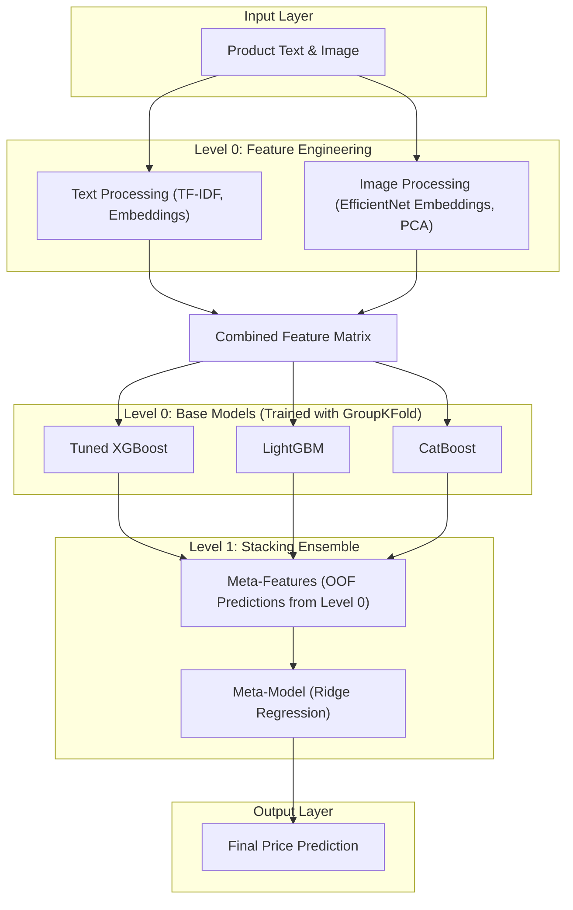

# ML Challenge 2025: Smart Product Pricing Solution Template

**Team Name:** [TedheMedhe123]  
**Team Members:** [Ritesh Kumar, Arpit Singh, MAMUN CHOWDHURY]
**Submission Date:** [12/10/2025]

---

## 1. Executive Summary
Our approach involved developing a multi-modal pricing model by engineering a rich feature set from both product text and images, including semantic embeddings and TF-IDF features. Key innovations included the systematic hyperparameter optimization of our gradient boosting models using Optuna and the implementation of a stacking ensemble, which trained a final meta-model to intelligently combine predictions for a more accurate and robust result. This methodical process of feature engineering, model tuning, and advanced ensembling was crucial for maximizing predictive performance.

---

## 2. Methodology Overview

The core challenge was a multi-modal regression task: predicting a product's price from unstructured text and an associated image. My interpretation was that both the text and image contained unique, complementary signals. The text provided explicit details like brand, quantity, and product features, while the image offered implicit cues about quality, branding, and product category.

### Key Observations:

Skewed Price Distribution: The target variable (price) was heavily right-skewed. A log-transformation was applied to create a more normal distribution, which is crucial for stabilizing gradient-based models.

Brand Signal: Brand name, extracted from the product title, proved to be a powerful predictive feature. This led to the critical decision to use GroupKFold cross-validation to prevent data leakage and ensure our performance metrics were realistic.

Non-Uniform Error: Error analysis revealed that the model struggled most with the very lowest-priced and highest-priced items. This indicated that a single modeling strategy might not be optimal across all price ranges, justifying our later use of dynamic ensembling.

### 2.2 Solution Strategy

Outline your high-level approach (e.g., multimodal learning, ensemble methods, etc.)

My high-level approach was a systematic, multi-stage ensemble learning strategy. The process began with extensive feature engineering from both text and image modalities to create a rich dataset. I then trained a diverse set of powerful gradient boosting models (LightGBM, XGBoost, CatBoost), optimized the best-performing one with automated hyperparameter tuning, and finally combined their predictions using a stacking meta-model to achieve the most accurate and robust final result.

### Approach Type: Hybrid Ensemble Learning

Core Innovation: The primary technical contribution was the implementation of a stacking ensemble. After tuning the individual models, a final Ridge meta-model was trained on their out-of-fold predictions. This allowed the system to learn the optimal, non-linear way to combine the base models' outputs, proving more effective than manual weighted blending and providing a significant boost to the final SMAPE score.

---

## 3. Model Architecture

### 3.1 Architecture Overview
Our final solution is a two-level stacking ensemble architecture. The first level consists of three diverse, powerful gradient boosting models that learn from a rich, multi-modal feature set. The second level consists of a simple linear meta-model that learns the optimal way to combine the predictions from the first-level models.

This architecture is designed to maximize predictive accuracy by first capturing complex, non-linear patterns with the base models and then elegantly blending their outputs for a final, robust prediction.

Here is a flowchart of the architecture:

### 3.2 Model Components

**Text Processing Pipeline:**

Preprocessing steps:

Parsed catalog_content to separate title and description.

Generated TF-IDF vectors from the combined text, then applied Truncated SVD to reduce dimensionality.

Model type: For semantic features, we used a pre-trained SentenceTransformer model to generate embeddings from the product titles.

Key parameters:

SentenceTransformer Model: all-MiniLM-L6-v2 (producing 384-dimensional vectors).

TF-IDF -> SVD: Reduced to 100 components.

**Image Processing Pipeline:**
Preprocessing steps:

Resized all images to a standard 224x224 pixels.

Applied standard ImageNet normalization to the pixel values.

Model type: A pre-trained EfficientNet-B0 model (from the timm library) was used as a feature extractor to generate powerful image embeddings. The resulting high-dimensional embeddings were then reduced using PCA.

Key parameters:

EfficientNet Model: efficientnet_b0.

PCA: Reduced image embedding dimensionality to 128 components.

---

## 4. Model Performance

### 4.1 Validation Results
- **SMAPE Score:** 58.3385

## 5. Conclusion
Our systematic approach combined multi-modal feature engineering with a robust stacking ensemble to maximize predictive accuracy on this complex pricing task. The key achievement was a measurable SMAPE score improvement, driven by the automated hyperparameter tuning of our base models and the intelligent blending learned by our final meta-model. Ultimately, we learned that a sophisticated ensembling technique like stacking is more impactful than simple feature addition, especially when powerful embedding features are already in use.

---